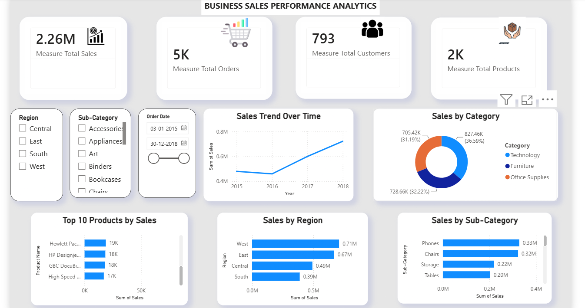
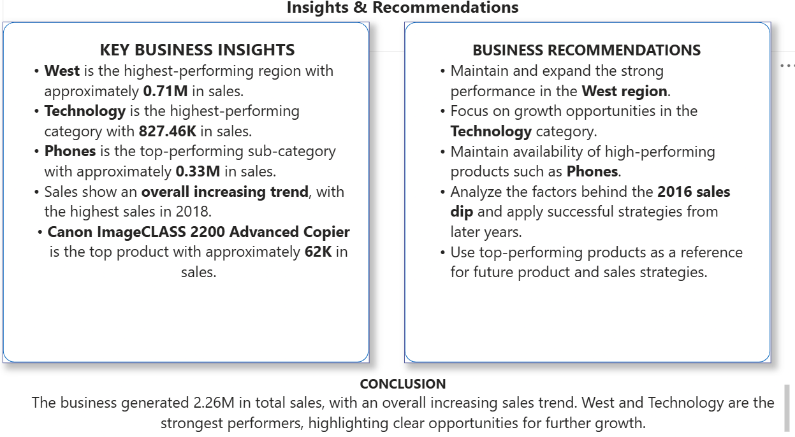

# FUTURE_DS_01
# Business Sales Analysis Dashboard

## 📌 Project Overview

This project analyzes business sales data using Power BI to identify sales trends, product performance, category performance, and regional performance.

The goal is to provide business-focused insights that can help identify growth opportunities and areas for improvement.

## 🎯 Objectives

- Analyze overall sales performance
- Identify high-performing regions
- Analyze category and sub-category performance
- Identify top-performing products
- Understand sales trends over time
- Provide actionable business recommendations

## 🛠️ Tools Used

- Power BI
- Excel / CSV Dataset
- Data Cleaning and Visualization
- Business Analytics

## 📊 Key KPIs

| KPI | Value |
|---|---:|
| Total Sales | 2.26M |
| Total Orders | 5K |
| Total Customers | 793 |
| Total Products | 2K |

## 🔍 Key Insights

- West is the highest-performing region with approximately 0.71M in sales.
- Technology is the highest-performing category with 827.46K in sales.
- Phones are the top-performing sub-category with approximately 0.33M in sales.
- Sales show an overall increasing trend, with the highest sales in 2018.
- Canon ImageCLASS 2200 Advanced Copier is the top-performing product with approximately 62K in sales.

## 💡 Business Recommendations

- Maintain and expand the strong performance of the West region.
- Focus on growth opportunities within the Technology category.
- Maintain availability of high-performing products such as Phones.
- Analyze the factors contributing to the increase in sales over time.
- Use top-performing products as a reference for future product strategy.

## 📈 Dashboard

The Power BI dashboard contains:

- KPI Cards
- Interactive Slicers
- Regional Performance Analysis
- Category and Sub-category Analysis
- Sales Trend Analysis
- Top Product Analysis
- Business Insights
- Recommendations
  ## 📸 Dashboard Preview

### Dashboard

### Insights & Recommendations

## 📁 Project Files

- Power BI Dashboard (.pbix)
- Dataset
- Dashboard Screenshots
- Project Documentation

## 👩‍💻 Author

Rachana Khede
